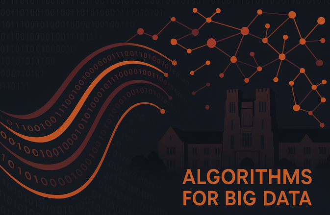

Course materials for Algorithms for Big Data covering distributed computing, MapReduce, and large-scale data processing techniques.

## Topics

- [Distributed Computing](./notes/distributed-computing)
- [MapReduce and Spark](./notes/mapreduce-spark)
- [Stream Processing](./notes/stream-processing)

