## Markdown Syntax Overview

:::tip[Markdown Authoring Documentation!]
Refer to Starlight's full documentation for more details on Markdown and its own custom features: https://starlight.astro.build/guides/authoring-content/
:::

### Paragraph Styles

This is a regular paragraph with **bold text** and _italic text_. You can also use **_bold and italic together_**. This paragraph demonstrates how text can be styled inline to emphasize important concepts.

**Blockquotes:**

> This is a blockquote. Blockquotes are useful for highlighting important information or quotes from other sources. They stand out visually from regular paragraph text.
>
> > Blockquotes can also be nested for more complex highlighting.
> >
> > > You can nest as deeply as needed.

### Lists

#### Unordered List

- First item in the list
- Second item with more detail
  - Nested item under second
  - Another nested item
  - Some more nesting to show depth
- Third item at the top level

#### Ordered List

1. First step in the process
2. Second step with explanation
   1. Sub-step A
   2. Sub-step B
3. Third step to complete

### Inline Code

You can use `inline code` to highlight specific terms or commands within a sentence. For example, to install a package, you might run `npm install package-name` in your terminal, or to sync a project's npm dependencies, you can use `npm ci` for a clean install.

A very long bash one-liner:

```bash
find . -type f -name "*.log" -mtime -7 | while read file; do echo "Processing: $file"; wc -l "$file" | awk '{print "Total lines:", $1}'; echo "---"; done
```

### Tables

| Feature     | Supported | Notes                             |
| ----------- | --------- | --------------------------------- |
| Markdown    | Yes       | Full CommonMark support           |
| LaTeX       | Yes       | Use `$` for inline math           |
| Code blocks | Yes       | Language syntax highlighting      |
| Tables      | Yes       | Standard GitHub Flavored Markdown |

### Task Lists

Task lists are useful for tracking progress or creating checklists:

- [x] Completed task
- [ ] Incomplete task
- [x] Another completed task with more details
- [ ] Yet another task to be done

### Strikethrough

You can use strikethrough to show deleted or deprecated content: ~~this text is struck through~~. This is useful for showing what's no longer relevant.

### Images

You can embed images in your documentation:


Alternatively, use HTML for more control:


### Special Characters, Escaping, and Spacing

When you need special markdown characters to appear literally, use backslashes to escape them:

- \*This would normally be italic but isn't\*
- \\This is a backslash followed by text
- \[Not a link\](<https://example.com>)
- \`Not inline code\`

For line breaks, end a line with two spaces to continue on the next line without creating a new paragraph:

This line ends with two spaces  
and this continues on a new line.

You can also use the HTML entity `&nbsp;` for non-breaking spaces: Word1&nbsp;&nbsp;&nbsp;Word2.

### Details and Disclosure

Use the `<details>` and `<summary>` elements to create collapsible/hideable content that users can expand on demand.

<details>
  <summary>What is a disclosure widget?</summary>
  
  A disclosure widget (also called an accordion or collapsible section) is an interactive element that hides content behind a clickable summary. Users can click to expand and view the full content.
</details>

<details>
<summary>What can I include inside a details element?</summary>

You can nest Markdown syntax inside the `<details>` element. Details elements are powerful for organizing complex documentation while keeping the page clean and readable.

- **Bold text** works
- _Italic text_ works
- `Code` works too
- And you can use [links](https://example.com)

**Mathematical Expressions**

Details elements support mathematical notation. Inline expressions like $E = mc^2$ work seamlessly, and you can also use display mode for complex equations:

$$
\frac{d}{dx}(x^2) = 2x
$$

The quadratic formula is another common expression:

$$
x = \frac{-b \pm \sqrt{b^2 - 4ac}}{2a}
$$

You can also include more advanced mathematical concepts:

$$
\int_{0}^{\infty} e^{-x^2} \, dx = \frac{\sqrt{\pi}}{2}
$$

**Code Examples**

This section demonstrates how you can use HTML elements and utility classes within a details element to achieve granular control over layout and formatting:

<div class="d-flex justify-content-between gap-3">
<div>

```c
#include <stdio.h>
#include <unistd.h>
#include <sys/wait.h>

// Process creation with fork()
int main() {
    printf("Parent: PID %d\n", getpid());

    pid_t child_pid = fork();

    if (child_pid == 0) {
        // Child process
        printf("Child: PID %d, Parent %d\n",
               getpid(), getppid());
        sleep(1);
        printf("Child: exiting\n");
        return 0;
    } else if (child_pid > 0) {
        // Parent process
        printf("Parent: created child %d\n",
               child_pid);

        int status;
        wait(&status);
        printf("Parent: child %d done\n",
               child_pid);
    } else {
        perror("fork");
    }
    return 0;
}
```

</div>
<div>

```c
#include <stdio.h>
#include <fcntl.h>
#include <unistd.h>
#include <string.h>

// File I/O syscalls
int main() {
    const char *filename = "data.txt";
    const char *data = "OS Syscalls!\n";

    // open() - create file for writing
    int fd = open(filename,
        O_CREAT | O_WRONLY | O_TRUNC,
        0644);

    if (fd < 0) {
        perror("open");
        return 1;
    }

    // write() - write to file
    ssize_t bytes = write(fd, data,
                          strlen(data));
    printf("Wrote %ld bytes\n", bytes);
    close(fd);

    // open() - reopen for reading
    fd = open(filename, O_RDONLY);
    char buf[64];

    // read() - read from file
    ssize_t n = read(fd, buf,
                     sizeof(buf) - 1);
    buf[n] = '\0';
    printf("Read: %s", buf);
    close(fd);

    return 0;
}
```

</div>
</div>

As you can see, details elements fully support complex HTML layouts. The flexbox container (`d-flex justify-content-between gap-3`) creates responsive multi-column layouts, while all other Markdown features (code blocks with syntax highlighting, math formulas, text styling) work seamlessly alongside the HTML structure. This enables precise formatting control for organizing rich content within collapsible sections.

</details>

<details>
  <summary>Multiple details sections</summary>
  
  You can have as many disclosure widgets as you want on a single page. Each one operates independently.
</details>

### HTML in Markdown

You can include raw HTML in your Markdown for more control over formatting:

<div style="background-color: #afafaf25; padding: 10px; border-radius: 5px;">
  <h3 style="color: #2bc2b4;">Custom HTML Block</h3>
  <p>This block is styled with inline CSS and demonstrates how you can use HTML within your Markdown content.</p>
</div>

### Starlight Components

Starlight provides built-in components for common documentation patterns. These are rendered natively by Starlight without extra imports.

#### Asides (Callouts)

Asides highlight important information in different styles:

:::tip[Did you know?]
Astro helps you build faster websites with "Islands Architecture".
:::

:::note
This is a neutral note that provides additional information.
:::

:::caution
This is a warning that something might need attention or could be problematic.
:::

:::danger
This indicates a critical issue or something that could break functionality.
:::

:::success
This confirms that an action was completed successfully.
:::

---

### Code Examples

#### JavaScript Example

```javascript {1,3}
function greet(name) {
  return `Hello, ${name}!`;
}

const result = greet("World");
console.log(result);
```

#### Python Example

```python title="fibonacci.py"
def fibonacci(n):
    if n <= 1:
        return n
    return fibonacci(n-1) + fibonacci(n-2)

for i in range(10):
    print(fibonacci(i))
```

#### Plain Text Example

```text
This is a plain text code block.
It can be used for any text that doesn't require syntax highlighting.
It preserves whitespace and formatting exactly as written.
It is useful for showing examples of text output, configuration files, or any content where formatting is important.
```

## Expressive Code Features

Expressive Code provides powerful features for code block presentation, including frames, text markers, and line markers. These enhance code display with visual indicators for important sections, changes, and context.

More details about these features can be found in the Expressive Code documentation:

- https://expressive-code.com/key-features/frames/
- https://expressive-code.com/key-features/text-markers/

### Editor & Terminal Frames

Expressive Code can render code blocks with editor window or terminal window frames to provide visual context.

#### Editor Frames

Display code in an editor-like frame by providing a filename with the `title` attribute:

```typescript title="src/utils/helpers.ts"
export function formatDate(date: Date): string {
  return date.toLocaleDateString("en-US", {
    year: "numeric",
    month: "long",
    day: "numeric",
  });
}

export function capitalize(str: string): string {
  return str.charAt(0).toUpperCase() + str.slice(1);
}
```

The `title` attribute displays the filename in an editor-like tab at the top of the code block.

#### Terminal Frames

Terminal code blocks are automatically detected based on language identifiers like `bash`, `sh`, `powershell`, and `console`. You can optionally add a title:

```bash title="Installation"
npm install package-name
npm run build
```

For terminal frames without a title, the frame will still render with a title bar:

```bash
echo "This is a terminal session"
ls -la
```

#### Frame Type Override

You can override the automatic frame detection using the `frame` attribute with values `code`, `terminal`, `none`, or `auto`:

```sh frame="none"
echo "Look ma, no frame!"
```

### Text & Line Markers

Mark specific lines or text within your code to highlight important sections, additions, or deletions.

#### Marking Full Lines

Mark individual lines or line ranges by adding line numbers in curly braces:

```javascript {1,3,5}
const greeting = "Hello";
const name = "World";
console.log(`${greeting}, ${name}!`);
const timestamp = new Date();
console.log(timestamp);
```

Use `{1,3,5}` to mark lines 1, 3, and 5. You can also use ranges: `{1-3,5}` marks lines 1 through 3 and line 5.

#### Marker Types: Mark, Insert, and Delete

Use different marker types to add semantic meaning to marked sections:

```javascript ins={3-4} del={2}
const greeting = "Hello";
console.log("this line is marked as deleted");
// These lines are marked as inserted
const result = `${greeting}, World!`;
console.log(result);
```

- `{N}` or `mark={N}` – Default neutral marker
- `ins={N}` – Marked as inserted (green)
- `del={N}` – Marked as deleted (red)

#### Marking Individual Text

Mark specific text within lines using quoted strings or regular expressions:

```javascript "important text"
function demo() {
  // Mark any important text inside lines
  return "Multiple matches of the important text are supported";
}
```

Use quotes around the text you want to mark. Regex patterns are also supported:

```javascript /ye[sp]/
console.log("The words yes and yep will be marked.");
```

#### Combining Markers

Combine multiple marker types and features together:

```python title="machine_learning.py" ins={6-8} del={2}
import numpy as np
from sklearn import split  # old import
from sklearn.model_selection import train_test_split
from sklearn.ensemble import RandomForestClassifier

X = np.random.randn(100, 4)
y = np.random.randint(0, 2, 100)
X_train, X_test, y_train, y_test = train_test_split(X, y, test_size=0.2)

clf = RandomForestClassifier(n_estimators=100)
clf.fit(X_train, y_train)
predictions = clf.predict(X_test)
```

For more detailed information about Expressive Code features, see the [official documentation](https://expressive-code.com/key-features/text-markers/) and [frames documentation](https://expressive-code.com/key-features/frames/).

---

## LaTeX Math

This page supports LaTeX mathematical expressions using rehype-mathjax.

### Inline Math

You can write inline math expressions like $E = mc^2$ or $a^2 + b^2 = c^2$ within your text. The Pythagorean theorem states that in a right triangle, $a^2 + b^2 = c^2$.

### Display Math

For larger or more complex equations, use display math mode:

$$\int_0^{\infty} e^{-x^2} \, dx = \frac{\sqrt{\pi}}{2}$$

### More Examples

The quadratic formula:

$$
x = \frac{-b \pm \sqrt{b^2 - 4ac}}{2a}
$$

The derivative of $f(x) = x^n$ is $f'(x) = nx^{n-1}$.

A beautiful mathematical identity (Euler's formula):

$$
e^{i\pi} + 1 = 0
$$

Matrix operations:

$$
\begin{pmatrix}
1 & 2 \\
3 & 4
\end{pmatrix}
\begin{pmatrix}
x \\
y
\end{pmatrix}
=
\begin{pmatrix}
x + 2y \\
3x + 4y
\end{pmatrix}
$$

---

## Graphviz Diagrams

Graphviz diagrams are rendered server-side using the DOT language. This supports flowcharts, trees, state machines, networks, and more.

### Simple Flowchart

A basic directed graph showing process flow:

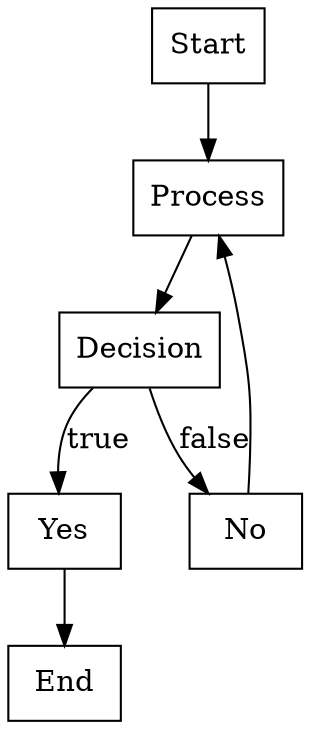

### Hierarchical Tree

A proper tree structure:

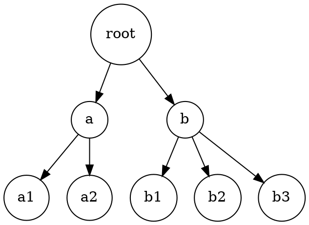

### State Machine

A finite state automaton:

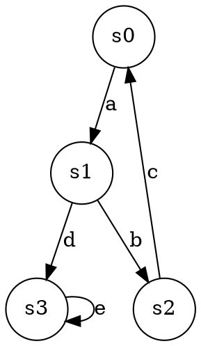

### Undirected Graph (Network)

An undirected network showing relationships:

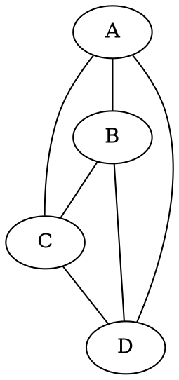

### Organizational Chart

A hierarchical organization structure:

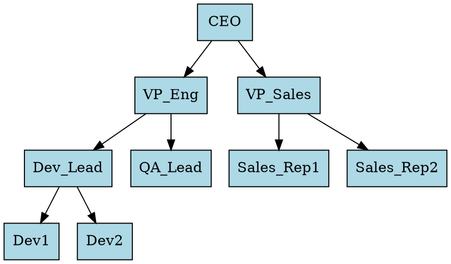

### Circular Layout

Using the `circo` layout engine for circular arrangements:

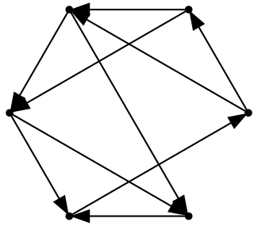

### Subgraph Clustering

Grouping related nodes together (useful for modules/components):

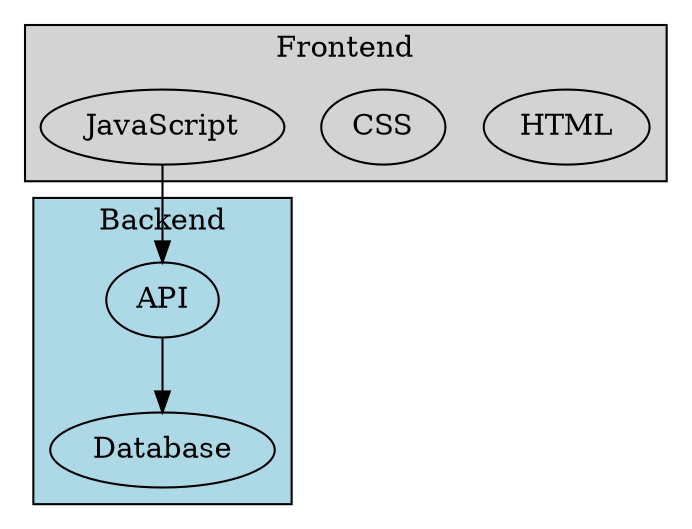

### Entity-Relationship Diagram

Database schema with relationships:

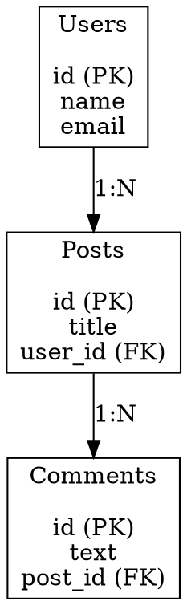

### Record Nodes

Structured nodes for classes or data structures:

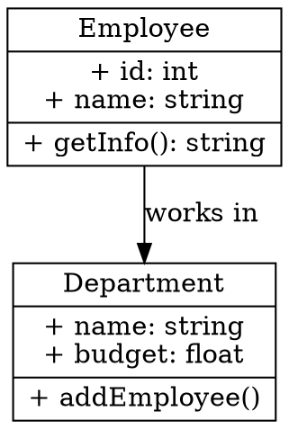

### Dependency Graph

Package or module dependencies:

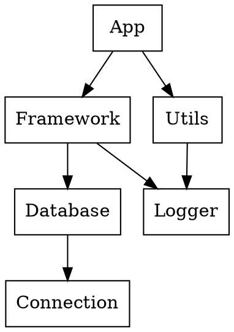

### Bipartite Graph

Two sets of nodes with relationships between them:

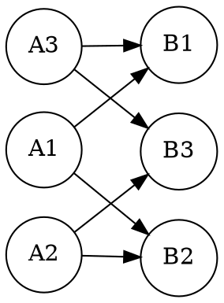

## Further Reading

- Explore [Markdown syntax](https://www.markdownguide.org/basic-syntax/) for more examples
- Learn about [GitHub Flavored Markdown](https://github.github.com/gfm/) for extended features
- Read [about reference pages](https://diataxis.fr/reference/) in the Diátaxis framework
